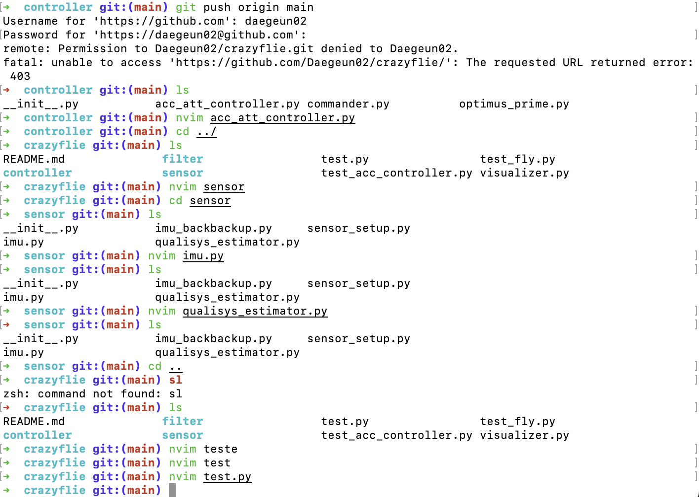

# crazyflie
acc feedback controller for crazyflie and etc...

This repository is source code for crazyflie wrapped library... 
Only for ACSL...

There's three big package to use crazyflie drone... 
In each package folder, there's README file to explain details about library... 

## 1. sensor

## 2. controller

## 3. filter

