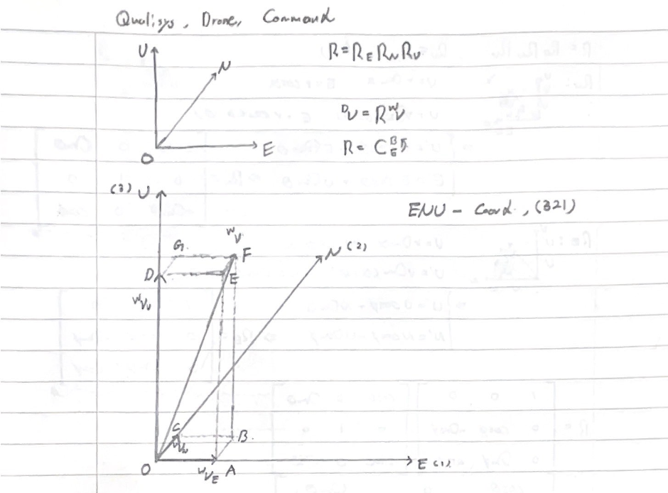
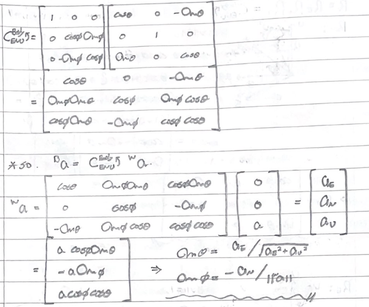

# Controller

## 1. Commander

__commander.py__ is a class to control crazyflie drone 

This class wraps crazyflie's send_setpoint function. 
There's one feedback loop to make sure that drone follow the command. 
Basically feedback loop get 10 Hz in 1 Hz of commander's send_setpoint function. 

It has three functions.

### 1. init_send_setpoint
This function initialize crazyflie's send_setpoint function. 
Just insert $[0,\ 0,\ 0,\ 0]$ as command.

### 2. send_setpoint
You can use this function as crazyflie's send_setpoint function. 
The main difference between this one and crazyflie's one is the input of function.
This function get __acc_cmd__ in __NED__ like $[a_{N},\ a_{E},\ a_{D}]$, 
but crazyflie's get __command__ like $[\phi,\ \theta,\ \dot{\psi},\ T]$. 
Because we thought it is more convenient for user who use our send_setpoint function. 
Thanks for __optimus_prime.py__ we can translate $[a_{N},\ a_{E},\ a_{D}]$ to $[\phi,\ \theta,\ \dot{\psi},\ T]$.

You can choose Hz of the feedback loop 1 ~ 10 Hz and Hz of this function is limited in 10 Hz. 

Here's about feedback loop in function

> To Be Continue..

### 3. stop_setpoint
It's simple. 
Just stop sending setpoint. 
We use crazyflie's __send_stop_setpoint__ function. 

## 2. Optimus Prime

### autobot!

__optimus_prime.py__ is functions that translate acc_command in NED to drone's coordinate in roll, pitch, yaw 
왜 optimus_prime 이냐?! .. 몰라요 묻지 마세요.. 내 맘이에요

### 1. _thust_to_RPY
This function translates acc_cmd in ENU coordinate to drone's body coordinate in roll, pitch, yaw, acc. 
Remember acc always towards z-direction of drone's coordinate. 
And coordinate ROTATES in 3 -> 2 -> 1 ORDER!! 

Please keep in mind these... and look at the image below.. 

In ENU coordinate, drone's acc vector can be anywhere. But this vector must be aligned on drone body's z-direction. 
So, we can figure out drone's coordinate in roll, pitch, yaw by rotating to align coordinate's z-basis with the acc vector. 

First of all, we don't rotate yaw.. It's complicate.. I'll write this later.. 

Second, rotate pitch. You can imagine triangle like OED in image above. 
In that triangle, $\angle EDO = {\pi \over 2}$ and $\angle EOD = \theta$. So, you can get $\theta$ easily with arcsin function. Like this,

$\theta = arcsin ({ ^{w}v_{E} \over \sqrt{ ^{w}v_{E}^{2} + ^{w}v_{U}^{2} } })$ 

Third, rotate roll. In this time, you can imagine triangle like OEF in image above. It little complicate..  
In that triangle, $\angle FEO = {\pi \over 2}$ and $\angle FOE = - \phi$. So, you can get $\phi$ easily as we did in Second. Like this,

$\phi = arcsin ({-^{w}v_{N} \over \lVert v \rVert})$ 

This image is show what you did in this three step.

Yeah! We get roll, pitch, yaw, acc from $a_{E}, a_{N}, a_{D}$ command!

### 2. _thrust_to_ENU
This function translate command in drone's body coordinate to ENU coordinate. 

Our coordinate rotate in 321 order, so rotation matrix is consisted of each rotation matrix in 123 order like this formula. 
$R = R_{E}R_{N}R_{U}$ 

Each rotation matrix can be derived from simple calculus. 
And we promised that we don't rotate yaw. 

Now we know rotation matrix that transform ENU coordinate vector to drone's body coordinate vector. Then, rotation matrix that transform drone's body coordinate vector to ENU coordinate vector is ... the transpose of rotation matrix! Because rotation matrix is orthonormal. 

So, acc vector in ENU coordinate is parallel with third column of transposed rotation matrix. With multiplying norm of acc, we can get $a_{E}, a_{N}, a_{U}$ from $\phi, \theta, \psi$, acc(norm of acc). 

But you can realize something is strange.

필자도 아는데 어디서 이런 요상한 일이 일어났는지 모르겠으니 교수님한테 갈거임. 일단 이상한 점은 밑의 그림을 참조해주세요.

해결했는데, 귀찮아서 나중에 할거임.